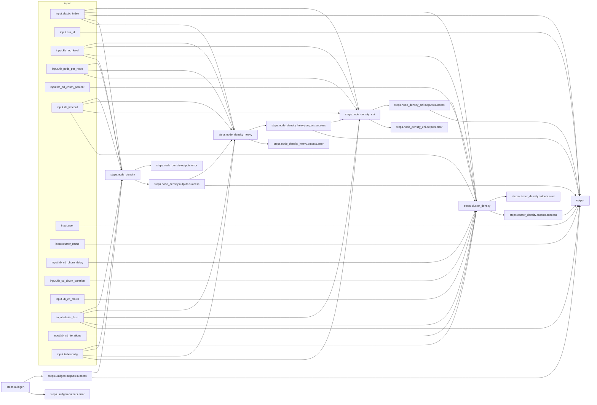

# Arcaflow kube-burner workflow
## How to run the workflow
- Download the [Arcaflow engine binary](https://github.com/arcalot/arcaflow-engine/releases) to your local system or jump host with network access to your Kubernetes/OpenShift cluster.
- Modify the [input.yaml](input-example.yaml) file to you needs (provided in this repo as `input-example.yaml` or `input-smoke.yaml`).
  - *Note: This currently requires the complete kubeconfig to be in the input file as YAML string. We will be enabling direct file input in a future enhancement. Example multi-line YAML string syntax with indentation:*
    ```yaml
    kubeconfig: |
      apiVersion: v1
      clusters:
      - cluster:
          certificate-authority-data: 
          ...
    ```
- Optional -- Setup a temporary elasticsearch server
  - ***NOTE: I'm leaving this section here for reference, but I don't think the elasticsearch server configured via this docker compose is compatible with kube-burner. More testing is needed. In the meantime, you will likely want to point to an existing ES instance that you know works for your needs.***
  - Included here is a [docker-compose-dev.yaml](docker-compose-dev.yaml) file, which you can use to quickly deploy an ephemeral elasticsearch container locally.
    ```bash
    $ docker-compose -f docker-compose-dev.yaml up -d
    ```
  - You can use this instance unauthenticated in the [input.yaml](input-example.yaml) file with:
    ```yaml
    elastic_host: "172.17.0.1"
    elastic_index: "test-index"
    ```
  - To tear down the elasticsearch container when you are finished with it:
    ```bash
    $ docker-compose -f docker-compose-dev.yaml down
    ```
- Optional -- Modify the [config.yaml](config-docker.yaml) file to your needs.
  - *Note: The default config uses the [docker deployer](https://arcalot.io/arcaflow/engine/#docker-deployer) for local plugin containers. You can also use the [podman deployer](https://arcalot.io/arcaflow/engine/#podman-deployer). Other parameters set in the config are mostly related to logging. Passing the `--config` option allows you to override the defaults.*
  - *All plugins are always run once initially via the default deployer in order for the engine to retrieve their schemas and build the workflow relationships. In the case of this test workflow, ALL workflow plugins are run completely locally via the default deployer since kube-burner itself handles the scheduling of the workloads in the cluster.*
- Run the workflow (this example assumes the `arcaflow` binary is in your `$PATH` and the `workflow.yaml` file is in the local directory):
  ```bash
  $ arcaflow --input input.yaml --config config-podman.yaml
  ```

### Asciinema recording of workflow

[](https://asciinema.org/a/565206)

## About Arcaflow
Arcaflow is a workflow engine that uses plugins to run a graph of container-based actions or workloads. Arcaflow requires no installation; only the `arcaflow` engine binary and a workflow file are needed to run a workflow. A workflow is typically initiated from a local system that has network access to remote Kubernetes or OpenShift cluster. A valid `kubeconfig` file is needed in order to run plugins in a remote cluster. Please see the [community documentation](https://arcalot.io/arcaflow) for more information.

## About the workflow

This test workflow is modeled after the [Airflow CI small-control-plane-mgs DAG used here](https://github.com/cloud-bulldozer/airflow-kubernetes/blob/master/dags/openshift_nightlies/config/benchmarks/small-control-plane-mgs.json).

The workflow uses primarily iterations of our work-in-progress [kube-burner OCP wrapper](https://github.com/Harshith-umesh/arcaflow-plugin-kube-burner) plugin ([container image in quay.io](https://quay.io/repository/humesh/arcaflow-plugin-kube-burner?tab=tags)). The default kube-burner parameters are set in the [workflow.yaml](workflow.yaml) file to match the referenced Airflow DAG above, but those parameters can also be overridden with the [input.yaml](input-example.yaml) file.

### input section
The input section defines the input schema that the workflow author exposes to the workflow user. This looks lengthy and verbose at first glance, but it's truly just a data structure definition, and the point of the verbose construct is to allow for self-documentation of the workflow and enabling a future user interface. Ultimately this section only defines the inputs, data types, descriptions, and any default values. These inputs are passed on to the workflow in the **steps** section.

### steps section
In the steps section is where the workflow graph is defined. Each step is a plugin, which is ultimately a container image. The inputs provided for the step must match the schema requirements of the individual plugin (information is included below for how to easily get the schema from the plugin). Here we mostly pass parameters from the workflow input or from the outputs of other plugins to the plugin input using an expression language.

```yaml
steps:
  ...
  node_density:
    plugin: quay.io/humesh/arcaflow-plugin-kube-burner:2
    step: kube-burner
    input:
      workload: 'node-density'
      uuid: !expr $.steps.uuidgen.outputs.success.uuid  #<<-- Output from UUID generator plugin
      pods_per_node: !expr $.input.kb_pods_per_node  #<<-- Directly from the workflow input
      ...
```
*Note: Currently by default all plugins are run in parallel unless an implicit dependency relationship is established between the plugins, such as requiring the output of one plugin for the input of another plugin. The workflow engine serializes plugins based on these established data relationships.*

*Because we currently do not have a feature that allows for explicit dependencies, and the CI and script workflows we are modeling against in this case use explicit steps (one kube-burner workload follows another without a direct relationship between the two), we are using a bit of a hack here where we pass the UUID as an output from one step to the UUID input of another step, thus establishing the implicit serialized workflow. Future engine enhancements will allow for explicit serialization of steps.*

```yaml
steps:
  ...
  node_density_heavy:
    plugin: quay.io/humesh/arcaflow-plugin-kube-burner:2
    step: kube-burner
    input:
      workload: 'node-density-heavy'
      uuid: !expr $.steps.node_density.outputs.success.uuid  #<<-- Output from previous k-b step
```

### output section
The output section defines the expected output data schema. These outputs are delivered to `STDOUT` when the workflow completes. If any of the defined output requirements cannot be fulfilled by the engine, such as if a plugin fails and its output is included in the workflow output, then the workflow will report as failed. Ultimately everything here is optional or dependent on how you use or integrate the workflow.

```yaml
output:
  uuid: !expr $.steps.uuidgen.outputs.success.uuid  #<<-- Output from a successful step
  run_id: !expr $.input.run_id  #<<-- Pass-through of a workflow input parameter as output
  user: 'foobar'  #<<-- Explicit hard-coded output
```


## Running the plugin stand-alone
All Arcaflow plugins can be run stand-alone as CLI tools. This is useful for building and testing specific functionality to later include in a workflow, or for running plugins one-off via direct execution or external automation.

The plugin has a defined input schema, which you can see in native/YAML or JSON format:
```bash
$ docker run -i quay.io/humesh/arcaflow-plugin-kube-burner:2 --schema
$ docker run -i quay.io/humesh/arcaflow-plugin-kube-burner:2 --json-schema=input
```

To run the plugin directly, you need to pass an input that matches the schema requirements. There is an [input-kube-burner-plugin.yaml](input-kube-burner-plugin.yaml) file included here for testing.
```bash
$ cat input-kube-burner-plugin.yaml | docker run -i \
quay.io/humesh/arcaflow-plugin-kube-burner:2 --step kube-burner --debug -f -
```

## Workflow graph
The [workflow.yaml](workflow.yaml) file defines the input schema, workflow steps and relationships, and the expected output schema of the workflow. The worflow is designed such that workload parameters can be modified via the [input.yaml](input-example.yaml). The complete workflow graph diagram looks like this:
