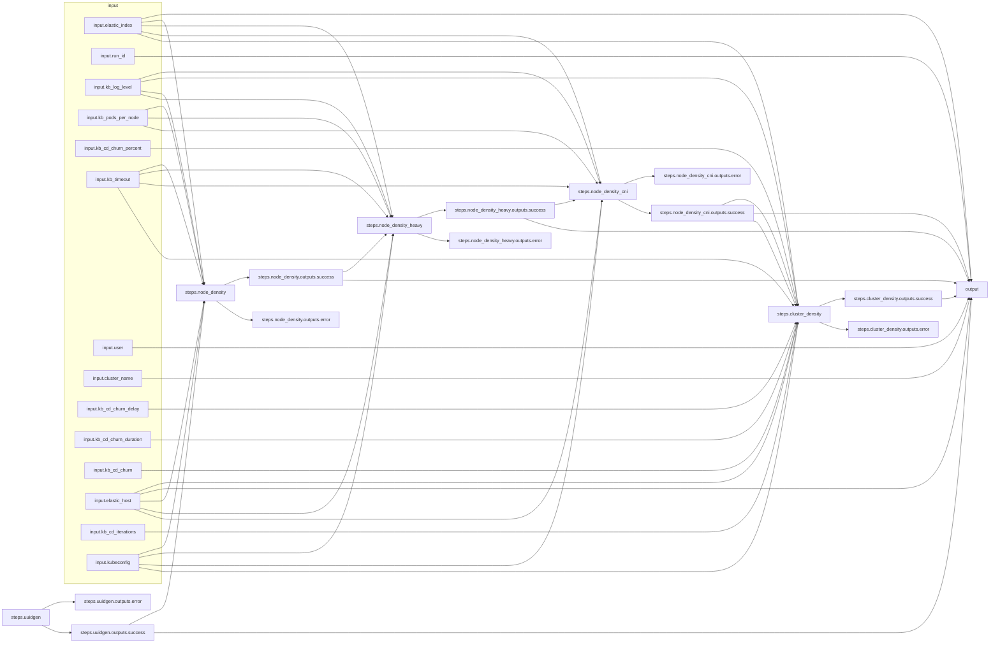

# Arcaflow kube-burner workflow
This test workflow is modeled after the [Airflow CI small-control-plane-mgs DAG used here](https://github.com/cloud-bulldozer/airflow-kubernetes/blob/master/dags/openshift_nightlies/config/benchmarks/small-control-plane-mgs.json).

## Workflow graph
