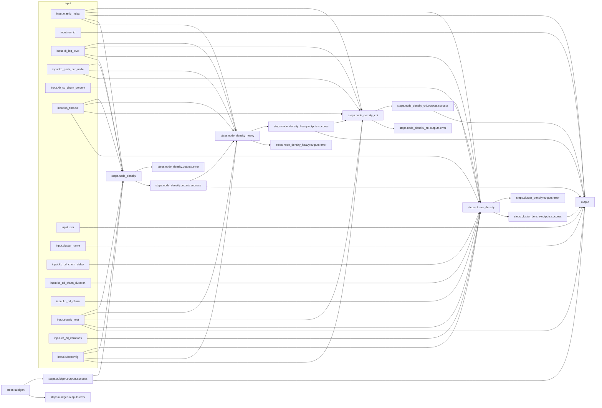

# Arcaflow kube-burner workflow
## About Arcaflow
Please see the [community documentation](https://arcalot.io).

## About the workflow

This test workflow is modeled after the [Airflow CI small-control-plane-mgs DAG used here](https://github.com/cloud-bulldozer/airflow-kubernetes/blob/master/dags/openshift_nightlies/config/benchmarks/small-control-plane-mgs.json).

## How to run the workflow
- Download the [Arcaflow engine binary](https://github.com/arcalot/arcaflow-engine/releases)
- Modify the [input.yaml](input-example.yaml) file to you needs.
  - *Note: This currently requires the complete kubeconfig to be in the input file as YAML string. Example multi-line YAML string syntax with indentation:*
    ```yaml
    kubeconfig: |
      apiVersion: v1
      clusters:
      - cluster:
          certificate-authority-data: 
          ...
    ```
- Optional -- Setup a temporary elasticsearch server
  - Included here is a [docker-compose-dev.yaml](docker-compose-dev.yaml) file, which you can use to quickly deploy an ephemeral elasticsearch container locally.
    ```bash
    $ docker-compose -f docker-compose-dev.yaml up -d
    ```
  - You can use this instance unauthenticated in the [input.yaml](input-example.yaml) file with:
    ```yaml
    elastic_host: "172.17.0.1"
    elastic_index: "test-index"
    ```
  - To tear down the elasticsearch container when you are finished with it:
    ```bash
    $ docker-compose -f docker-compose-dev.yaml down
    ```
- Modify the [config.yaml](config.yaml) file to your needs.
  - *Note: The default config uses the [docker deployer](https://arcalot.io/arcaflow/engine/#docker-deployer) for local plugin containers. You can also use the [podman deployer](https://arcalot.io/arcaflow/engine/#podman-deployer). Other parameters set in the config are mostly related to logging.*
  - *All plugins are run once initially via the default deployer in order for the engine to retrieve their schemas and build the workflow relationships.*
- Run the workflow (example assumes the `arcaflow` binary is in your `$PATH` and the `config.yaml` and `workflow.yaml` files are in the local directory):
  ```bash
  $ arcaflow --input input.yaml
  ```

## Running the plugin stand-alone
All Arcaflow plugins can be run stand-alone as CLI tools. This is useful for building and testing specific functionality to later include in a workflow, or for running plugins one-off via direct execution or external automation.

The plugin has a defined input schema, which you can see in native/YAML or JSON format:
```bash
$ podman run -i quay.io/humesh/arcaflow-plugin-kube-burner:latest --schema
$ podman run -i quay.io/humesh/arcaflow-plugin-kube-burner:latest --json-schema=input
```

To run the plugin directly, you need to pass an input that matches the schema requirements. There is an [input-kube-burner-plugin.yaml](input-kube-burner-plugin.yaml) file included here for testing.
```bash
$ cat input-kube-burner-plugin.yaml | podman run -i quay.io/humesh/arcaflow-plugin-kube-burner:latest --debug -f -
```

## Workflow graph
The [workflow.yaml](workflow.yaml) file defines the input schema, workflow steps and relationships, and the expected output schema of the workflow. The worflow is designed such that workload parameters can be modified via the [input.yaml](input-example.yaml). The complete workflow graph diagram looks like this:
