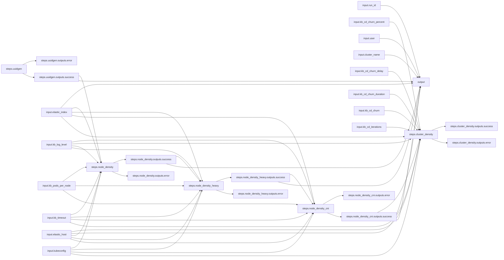

```mermaid
flowchart LR
steps.uuidgen-->steps.uuidgen.outputs.error
steps.uuidgen-->steps.uuidgen.outputs.success
input.elastic_index-->output
input.elastic_index-->steps.node_density
input.elastic_index-->steps.node_density_heavy
input.elastic_index-->steps.node_density_cni
input.elastic_index-->steps.cluster_density
input.run_id-->output
steps.node_density_heavy-->steps.node_density_heavy.outputs.success
steps.node_density_heavy-->steps.node_density_heavy.outputs.error
input.kb_log_level-->steps.node_density_cni
input.kb_log_level-->steps.cluster_density
input.kb_log_level-->steps.node_density
input.kb_log_level-->steps.node_density_heavy
input.kb_pods_per_node-->steps.node_density
input.kb_pods_per_node-->steps.node_density_heavy
input.kb_pods_per_node-->steps.node_density_cni
steps.node_density.outputs.success-->steps.node_density_heavy
steps.node_density.outputs.success-->output
input.kb_cd_churn_percent-->steps.cluster_density
input.kb_timeout-->steps.node_density
input.kb_timeout-->steps.node_density_heavy
input.kb_timeout-->steps.node_density_cni
input.kb_timeout-->steps.cluster_density
input.user-->output
input.cluster_name-->output
steps.uuidgen.outputs.success-->steps.node_density
steps.uuidgen.outputs.success-->output
steps.node_density-->steps.node_density.outputs.success
steps.node_density-->steps.node_density.outputs.error
input.kb_cd_churn_delay-->steps.cluster_density
steps.node_density_cni-->steps.node_density_cni.outputs.error
steps.node_density_cni-->steps.node_density_cni.outputs.success
input.kb_cd_churn_duration-->steps.cluster_density
steps.node_density_cni.outputs.success-->steps.cluster_density
steps.node_density_cni.outputs.success-->output
steps.node_density_heavy.outputs.success-->steps.node_density_cni
steps.node_density_heavy.outputs.success-->output
input.kb_cd_churn-->steps.cluster_density
input.elastic_host-->steps.cluster_density
input.elastic_host-->output
input.elastic_host-->steps.node_density
input.elastic_host-->steps.node_density_heavy
input.elastic_host-->steps.node_density_cni
input.kb_cd_iterations-->steps.cluster_density
input.kubeconfig-->steps.node_density
input.kubeconfig-->steps.node_density_heavy
input.kubeconfig-->steps.node_density_cni
input.kubeconfig-->steps.cluster_density
steps.cluster_density-->steps.cluster_density.outputs.success
steps.cluster_density-->steps.cluster_density.outputs.error
```